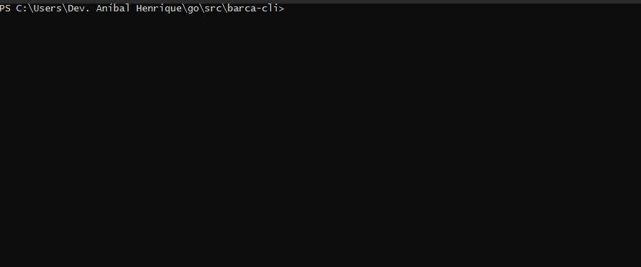
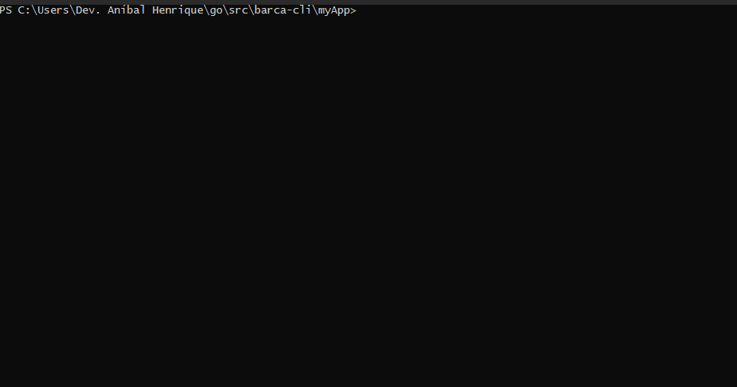

<p align="center">
 
 <h2 align="center">Barca CLI</h2>
 <p align="center">
  Barca CLI is a project generator written in GO and its purpose is to build and configure HTTP servers, web proxy, SPA/PWA, Blog and custom landing page. It's easy, fast and productive.
  </p>
 </p>
  <p align="center">
    <a href="https://github.com/anuraghazra/github-readme-stats/actions">
      
    </a>
    <a href="https://codecov.io/gh/anuraghazra/github-readme-stats">
      
    </a>
    <a href="https://a.paddle.com/v2/click/16413/119403?link=1227">
      
    </a>
    <a href="https://a.paddle.com/v2/click/16413/119403?link=2345">
      
    </a>
  </p>
   
  <p align="center">
    
    
    
    
  </p>

  <p align="center">
    <a href="/docs/lang/readme_fr.md">Français </a>
    ·
    <a href="/docs/lang/readme_cn.md">简体中文</a>
    ·
    <a href="/docs/lang/readme_es.md">Español</a>
    ·
    <a href="/docs/lang/readme_ru.md">русский</a>
    .
    <a href="/docs/lang/readme_ja.md">日本語</a>
    ·
    <a href="/docs/lang/readme_de.md">Deutsch</a>
    ·
    <a href="/docs/lang/readme_it.md">Italiano</a>
    ·
    <a href="/docs/lang/readme_kr.md">한국어</a>
    .
    <a href="/docs/lang/readme_uk.md">Українська</a>
    .
    <a href="/docs/lang/readme_pt-BR.md">Português Brasileiro</a>
    .
  </p>
</p>

### Using the Tool

  **CLI** (Command-Line Interface) is an environment where users can enter command lines to perform tasks in operating systems or in programming jobs.

<br>
<br>
<br>

Downloads all modules in the file to the local cache

```sh
go mod download
```
<br>
<br>

Run `go run main.go` with argument `--help` to list all CLI commands and flags
<br>

Example: 
```sh
go run main.go --help
```

<br>
<br>


To build an HTTP Web Server, let's mention `init` and `api` arguments to start a simple Rest API.
<br>
Example:

```sh
go run main.go init api <project-name>
```


<br>
<br>

<p align="center">
  
</p>

<br>
<br>
<br>

#### Specifying Language


You can translate **barca-cli** resource messages by specifying after `--lang` flag

Example:

```sh
go run main.go --lang francais init api <project-name>
```

<br>
<br>

<p align="center">
  
</p>

## Generate REST API

It is very simple to generate an API with **Barca CLI**, with a few commands you will allow the construction of the project the way you want.

The following is an example of how to generate a **REST API** in *Node.js* and configure your environment.

<br>
  1. Web Server
  2. Controllers, Routes & Models
  3. Database
<br>

#### Configure Server

Let's mention **flags** to configure the project, this is an example using the *Express.js* framework as a server running on port *4200*.

<br>

```sh
go run main.go --framework express --port 4200 init api <your-project>
```

<br>
<br>

<p align="center">
  
</p>


<br>
<br>

#### Specifying your language:

<br>

```sh
go run main.go --language francais --framework express --port 4200 init api <your-project>
```

<br>
<br>

<p align="center">
  
</p>


<br>
<br>


#### Add DB Templates

<br>

After building the server, let's add models to our project, specify the Database type that will be used with the `--database` flag and the table/collection with `--collection`. In the following example it is showing how to insert a user model for Database **MySQL**

<br>
<br>

```sh
go run main.go --database mysql --collection users  add model <your-project>
```


<br>
<br>

<p align="center">
  
</p>

<br>
<br>

#### Integrate MySQL

Now we need to inform by **flags** the settings to access and connect to our server **MySQL**

<br>

```sh
go run main.go --dbname testdb --host 127.0.0.1 --user root --password 12345 integrate mysql <seu-projeto>
```

<br>
<br>

<p align="center">
  
</p>


<br>
<br>

## Contribuidores

Caros amigos(a) contribuidores no projeto <br><br>
<a href="https://github.com/project-barca/barca-cli/graphs/contributors"></a>
